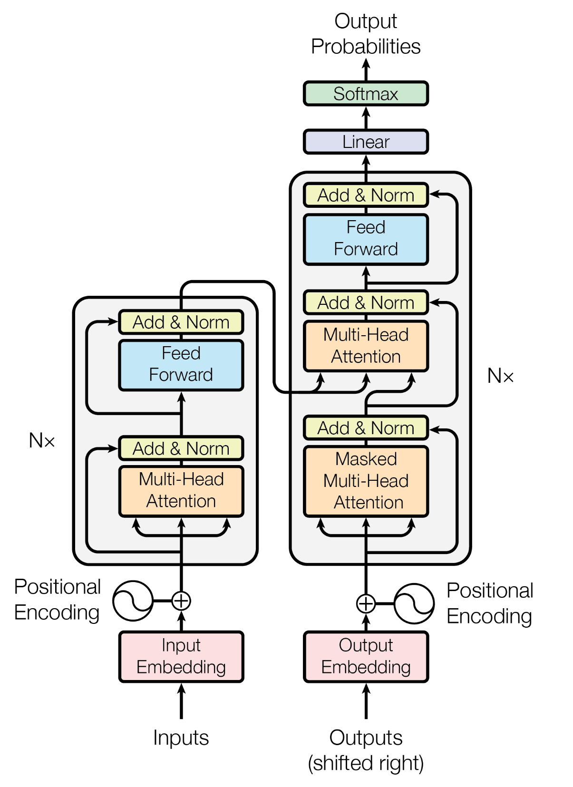
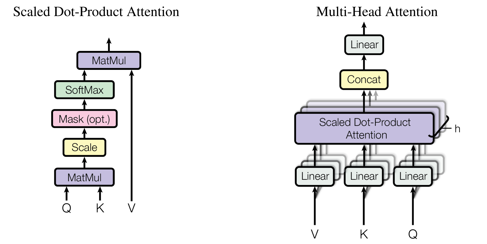

# Transformer

2017 年，谷歌团队提出 Transformer 结构，Transformer 首先应用在**自然语言处理**领域中的**机器翻译**任务上，Transformer 结构完全构建于**注意力机制**，完全丢弃递归和卷积的结构，这使得 Transformer 结构效率更高。迄今为止，Transformer 广泛应用于深度学习的各个领域。


## 模型架构

Transformer 结构如下图所示，Transformer 遵循了**编码器-解码器**（Encoder-Decoder）的结构，每个 Transformer  Block 的结构**基本上是相同的**，其编码器和解码器可以视为**两个模型**，例如：在 Vision Transformer 中仅使用了 Transformer 编码器，而在 GPT 中仅使用了 Transformer 解码器。



### 编码器


### 解码器

对于 Transformer Encoder Block 而言，包含：**多头注意力**（Multi-Head Attention）层和**前馈神经网络层**（Feed Forward Network），对于 Transformer Decoder Block 而言，还包含了一个**掩码多头注意力层**（Masked Multi-Head Attention）。同时，Transformer 结构使用了在 ResNet 引入的**残差连接**（Residual Connection），以及**层归一化**（Layer Normalization）。其中，引入残差连接和层规范化可以使模型更容易学习，在 Transformer 中，为了便于残差连接，模型的**隐藏层维度保持一致**，即 FFN 层和 attention 层的输出都是相同的维度。

**注意：**通常情况下，在 NLP 领域中，使用的归一化/规范化层都是**层归一化**，批量归一化（Batch Normalization）通常应用于视觉领域。层归一化和批量归一化的操作几乎是一样的，即减去均值、除以标准差，但是有一些细节的区别，对于层归一化，均值和标准差是在**单个样本**特征上计算而来的，与批量大小（Batch Size）无关；对于批量归一化，均值和标准差是在同一批量的**所有样本**上计算来的，与批量大小有关，且批量大小越大，批量归一化的性能越好。


## 注意力机制

在 Transformer 之前，注意力机制就已经存在了，注意力机制包括两种类型：加性注意力和乘性注意力。Transformer 使用的是**乘性注意力**，这也是最常见的注意力机制，首先计算一个**点积相似度**，然后通过 Softmax 后得到注意力权重，根据注意力权重对 V 进行加权求和，具体的过程可以表示为以下数学公式：

$$
\text{Attention}(Q,K,V)=\text{softmax}(\frac{QK^T}{\sqrt{d_k}})V
$$



可以观察到注意力的计算中包含了一个温度参数 $\sqrt{d_k}$，一个直观的解释是避免点积的结果过大或过小，导致 softmax 后的结果接位于 softmax 函数梯度几乎为 0 的区域，减慢模型的收敛速度，最理想的情况是点积结果处于 0 附近。

此外，Attention 的计算还可以包含一个**掩码**操作，这对于**自回归**（Auto Regressive）生成任务来说是必要的，因为我们不希望前面生成的 token 关注后面生成 token，因此可能会采用一个**下三角的 Attention Mask**，掩盖掉 attention 矩阵的上三角部分，因此 Attention 的计算可以重写为以下数学式：

$$
\text{Attention}(Q,K,V)=\text{softmax}(\frac{QK^T}{\sqrt{d_k}}+M)V
$$

需要掩码的部分对应的 Attention Mask 的值设为负无穷即可，这会使得在 softmax 操作后得到的注意力权重为 0，从而达到避免注意到某些不该注意到的 token 。

但这样的注意力机制是**不包含可学习的参数**的，因此在 Transformer 中引入了**多头注意力**机制，其中一个目的就是引入可学习参数，同时希望多头注意力能够捕捉多种模式，类似于卷积。多头注意力机制可以表示为以下数学式：

$$
\text{MultiHead}(Q,K,V)=\text{Concat}(\text{head}_1,\text{head}_2,\dots,\text{head}_h)W^O\\


\text{where } \text{head}_i= \text{Attention}(QW_i^Q,KW_i^K,VW_i^V)
$$

虽然引入了多头注意力机制，但是计算量与单头注意力机制是相同的。

下面是多头注意力机制的 PyTorch 实现代码：

```python
from torch import nn, Tensor
from functools import partial

class MultiHeadAttention(nn.Module):
    """Multi-Head Attention."""

    def __init__(self, d_model: int, n_heads: int) -> None:
        super(MultiHeadAttention, self).__init__()
        self.n_heads = n_heads
        self.proj_q = nn.Linear(d_model, d_model)
        self.proj_k = nn.Linear(d_model, d_model)
        self.proj_v = nn.Linear(d_model, d_model)
        self.proj_o = nn.Linear(d_model, d_model)
        self.attention = ScaledDotProductAttention()

    def forward(
        self, q: Tensor, k: Tensor, v: Tensor, mask: Tensor | None = None
    ) -> Tensor:
        # input tensor of shape (batch_size, seq_len, d_model)
        # 1. linear transformation
        q, k, v = self.proj_q(q), self.proj_k(k), self.proj_v(v)
        # 2. split tensor by the number of heads
        q, k, v = map(partial(_split, n_heads=self.n_heads), (q, k, v))
        # 3. scaled dot-product attention
        out = self.attention(q, k, v, mask)
        # 4. concatenate heads
        out = _concat(out)
        # 5. linear transformation
        return self.proj_o(out)


class ScaledDotProductAttention(nn.Module):
    """Scaled Dot-Product Attention."""

    def __init__(self) -> None:
        super(ScaledDotProductAttention, self).__init__()
        self.softmax = nn.Softmax(dim=-1)

    def forward(
        self, q: Tensor, k: Tensor, v: Tensor, mask: Tensor | None = None
    ) -> Tensor:
        # input tensor of shape (batch_size, n_heads, seq_len, d_head)
        d_k = k.size()[3]
        k_t = k.transpose(2, 3)
        # 1. compute attention score
        score: Tensor = (q @ k_t) * d_k**-0.5
        # 2. apply mask(optional)
        if mask is not None:
            score = score.masked_fill(mask == 0, float("-inf"))
        # 3. compute attention weights
        attn = self.softmax(score)
        # 4. compute attention output
        out = attn @ v
        return out


def _split(tensor: Tensor, n_heads: int) -> Tensor:
    """Split tensor by the number of heads."""
    batch_size, seq_len = tensor.size()[:2]
    d_model = tensor.size()[2]
    d_head = d_model // n_heads
    return tensor.view(batch_size, seq_len, n_heads, d_head).transpose(1, 2)


def _concat(tensor: Tensor) -> Tensor:
    """Concatenate tensor after splitting."""
    batch_size, n_heads, seq_len, d_head = tensor.size()
    d_model = n_heads * d_head
```


